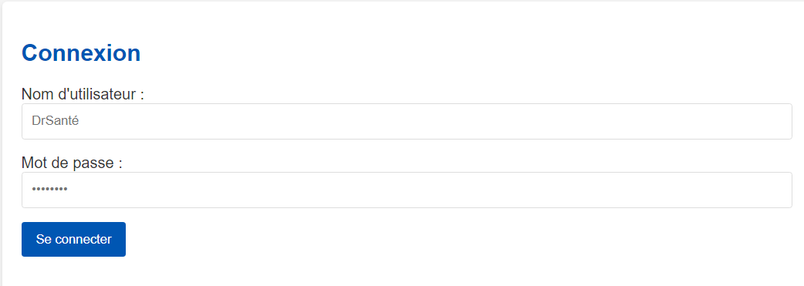
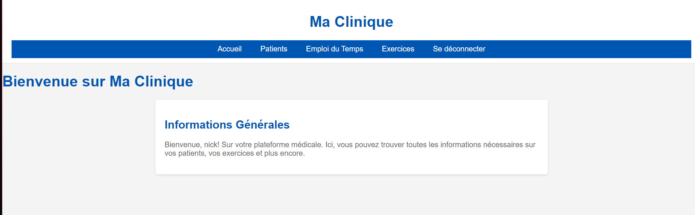
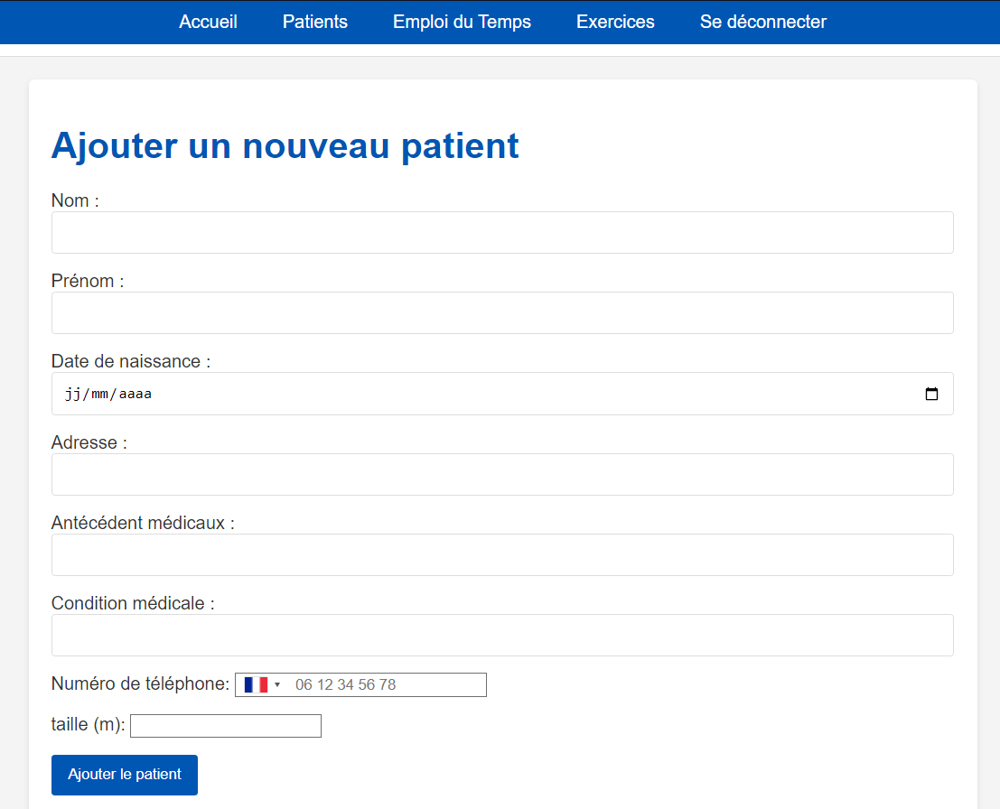
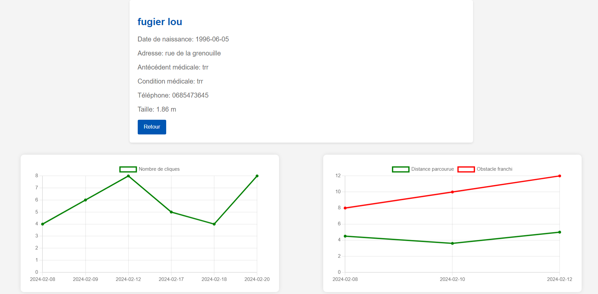
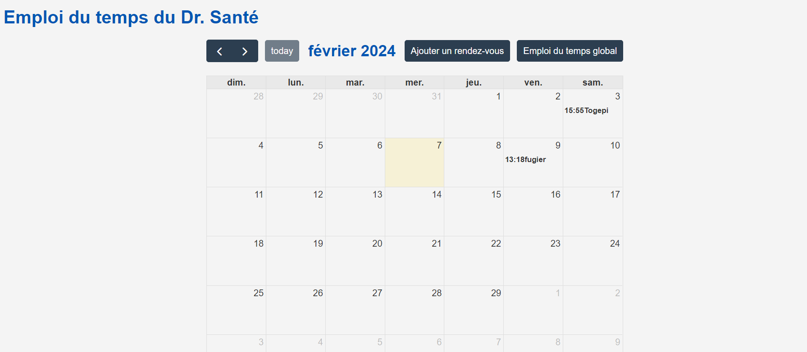
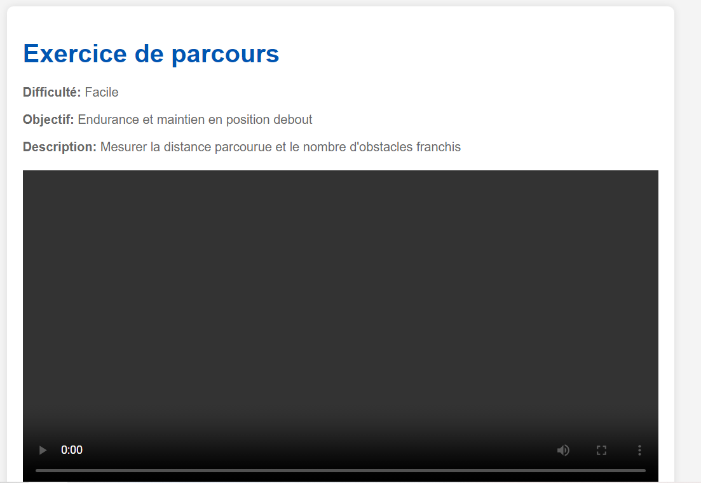
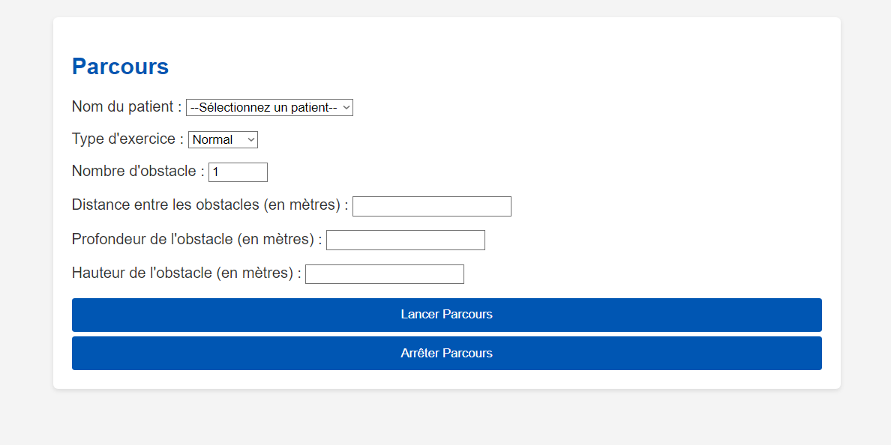

# 🧠 HoloReed – Mixed Reality Rehabilitation Platform

> [English](#english) | [Français](#francais)

---

## English

HoloReed is a multidisciplinary project that combines a web platform and mixed reality technologies to assist Parkinson's patients in their rehabilitation process. It was developed as part of an academic project at ESIGELEC.

## 🧠 Concept

The system has two main components:

1. **Web Platform**  
   - Used by doctors to register patients, track rehabilitation progress, and assign physical therapy exercises.  
   - Communicates with a secure database to store patient profiles and metrics.  
   - Exercises can be selected and pushed to the headset.

2. **Mixed Reality Headset**  
   - Patients use a HoloLens device to perform physical exercises.  
   - The headset displays guided 3D exercises in a gamified environment.  
   - Metrics (precision, duration, repetitions) are collected and sent back to the web platform.

## 🛠️ Tech Stack

- **Frontend**: JavaScript, HTML, CSS  
- **Backend**: Node.js  
- **Database**: MySQL  
- **Mixed Reality**: Unity with C#  

## 🎬 YouTube Demo

📺 Watch the demo video on YouTube:  

## 📷 Screenshots

<ins>Platform views:</ins>  
  
  
  
  
  
  
  
  

---

## Francais

HoloReed est un projet académique combinant une plateforme web et des exercices en réalité mixte pour accompagner les patients atteints de la maladie de Parkinson dans leur rééducation.

## 🧠 Concept

Le système est composé de deux éléments principaux :

1. **Plateforme Web**  
   - Interface destinée aux médecins pour suivre les patients, gérer leur profil, prescrire des exercices et consulter les métriques.  
   - Connectée à une base de données sécurisée (MySQL).  
   - Les exercices peuvent être assignés et envoyés au casque.

2. **Casque de Réalité Mixte**  
   - Exercices en 3D développés avec Unity (C#) pour le casque HoloLens.  
   - Mesure de la performance du patient : précision, durée, répétitions.  
   - Résultats synchronisés avec la plateforme web.

## 🛠️ Technologies

- **Frontend** : JavaScript, HTML, CSS  
- **Backend** : Node.js  
- **Base de données** : MySQL  
- **Réalité Mixte** : Unity avec C#  

## 🎬 Vidéo Démo

📺 Voir la démo sur YouTube :  

## 📷 Aperçu

<ins>🌐 Interface Web :</ins>  
  
  
  
  
  
  
  
  

